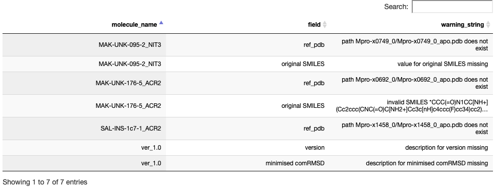

# Installation
__Requires:__ Conda, python 3.6.  
    
To install, clone this repo, and then install of the conda things with `conda env create --file environment.yml`. Activate the environment with `source activate sdf_check`.    
    
There is a jupyter notebook in this repo that will help you get started (instructions also repeated below):    

# Validating your sdf file for submission
```
# import all of the things
from validate import validate
import pandas as pd
import itables.interactive
from itables import show
```

We have imported the validate function from `validate.py`. This function takes only one argument: the filepath to the sdf file you want to validate.     

The function returns two things:    
- a dictionary containing the results of the validation    
- a True/False value for if the file is valid.     

We have provided a file (compound-set_fragmenstein.sdf') with lots of problems in it, so we can demonstrate how the validation works.     
    
First, we get our results and validation status by running our file through validate.     
    
We can see below that this file is not valid:    

```{.python .input  n=2}
[In]: results, valid = validate('compound-set_fragmenstein.sdf')
[In]: print(valid)
```

```
[Out]: 4 mols detected (including blank mol)
[Out]: False
```

# Viewing the problems

Here, we have taken the results dict from validate, and transformed them into a pandas dataframe. We can display this as an interactive table to see what the issues with the file are:

```{.python .input  n=3}
[In]: warnings_table = pd.DataFrame.from_dict(results)
[In]: show(warnings_table)

[Out]:
```

